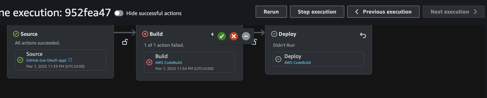
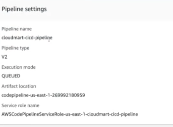
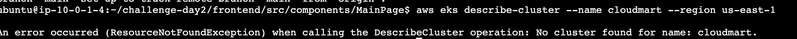

# Day 3 off the multi-cloud challenge

We first start by going to codepipeline
This codepipeline allow us to build our pipeline and deploy it to the cloud.

we will need to authenticate our pipeline with github.
This process allows github to trigger the pipeline when a new commit is pushed to the repository.
The only part off the process thats hard is getting the password. This is obtained by:

1. Go to your github account settings
2. Click on Developer settings
3. Click on Personal access tokens
4. Click on Generate new token
5. Give it a name and select the scopes you want to give it access to
6. Click on Generate token
7. Copy the token and paste it into the pipeline
8. Click on Save changes

Inspect the pipeline and make sure it is working correctly.


The CodePipeline Setting was done with the help off the AWS GUI. This is the screenshot off the settings used.


AS we can see the pipeline is working but the build stage had a problem. This is where the debugging process starts.
we needed to add permissions with least privilege to the build stage. This is done by adding them to a json file. The final permissions needed were:

```
{
	"Version": "2012-10-17",
	"Statement": [
		{
			"Effect": "Allow",
			"Action": [
				"sts:GetServiceBearerToken",
				"ecr:GetAuthorizationToken",
				"ecr-public:GetAuthorizationToken"
			],
			"Resource": "*"
		},
		{
			"Effect": "Allow",
			"Action": [
				"ecr:BatchCheckLayerAvailability",
				"ecr:BatchGetImage",
				"ecr:CompleteLayerUpload",
				"ecr:InitiateLayerUpload",
				"ecr:PutImage",
				"ecr:UploadLayerPart",
				"ecr:DescribeRepositories",
				"ecr:ListImages",
				"ecr:CreateRepository",
				"ecr:DeleteRepository",
				"ecr:DeleteRepositoryPolicy",
				"ecr:SetRepositoryPolicy",
				"ecr:PutLifecyclePolicy",
				"ecr:DescribeImages",
				"ecr:BatchDeleteImage",
				"ecr:GetDownloadUrlForLayer"
			],
			"Resource": "*"
		},
		{
			"Effect": "Allow",
			"Action": [
				"ecr-public:BatchCheckLayerAvailability",
				"ecr-public:CompleteLayerUpload",
				"ecr-public:InitiateLayerUpload",
				"ecr-public:PutImage",
				"ecr-public:UploadLayerPart",
				"ecr-public:DescribeRepositories",
				"ecr-public:CreateRepository",
				"ecr-public:DeleteRepository",
				"ecr-public:DescribeImages",
				"ecr-public:BatchDeleteImage",
				"ecr-public:GetRepositoryCatalogData",
				"ecr-public:PutRepositoryCatalogData"
			],
			"Resource": "*"
		},
		{
			"Effect": "Allow",
			"Action": [
				"logs:CreateLogGroup",
				"logs:CreateLogStream",
				"logs:PutLogEvents"
			],
			"Resource": "arn:aws:logs:us-east-1:449095351082:log-group:/aws/codebuild/cloudmartBuild:*"
		},
		{
			"Effect": "Allow",
			"Action": [
				"eks:DescribeCluster",
				"eks:ListClusters",
				"eks:AccessKubernetesApi"
			],
			"Resource": "arn:aws:eks:us-east-1:449095351082:cluster/cloudmart"
		}
	]
}

```

This was all the privileges needed. for testing purposes the easier option will be to give the user admin access. This is not the safest option, but it is the easiest.
after we added the right privileges the build will be able to access the ECR repository and push the image to it.


Image off the build process done.

Final step was to work on the deployment stage off the project. This stage we focused on building the deployment pipeline.
We debugged it until we got it working the only problem was that the EKS cluster was deleted.This is the cloudwatch log showing that the cluster was deleted.
[]

The EKS cluster is a bit too expensive to run. It also doesn't have a free tier. running it for a day cost me $1.80.

## Navigation
- [Back to Main README](../README.md)
- [Day 1 - Cloud Infrastructure](../day1/README.md)
- [Day 4 - Lambda and DynamoDB](../day4/README.md)
