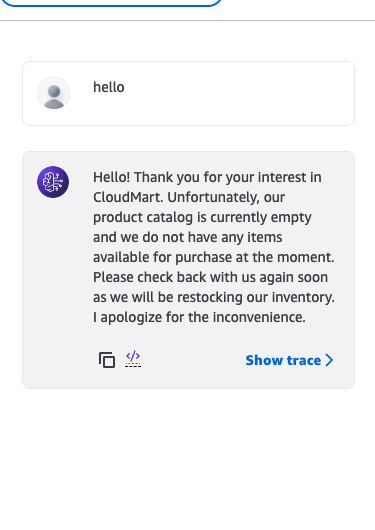

# Day 4 - Lambda and DynamoDB

This section implements AWS Lambda functions with DynamoDB integration and an AI agent for customer reviews.

## Contents
- `lambda.tf` - Terraform configuration for Lambda functions and DynamoDB tables
- `inline_schema.txt` - Schema definition for the AI agent
- `main.go` - Go implementation code
- `test.py` - Test script for the implementation

We worked on creating an AI agent that allows us to process customer reviews.
Screenshot of the AI agent working:

Model Creation:
Configuring the Amazon Bedrock Agent

Follow these steps to manually create the Bedrock Agent for CloudMart:

Model Access:

1. In the Amazon Bedrock console, go to "Model access" in the navigation panel.
2. Choose "Enable specific models".
3. Select the Claude 3 Sonnet model.
4. Wait until the model access status changes to "Access granted".

## Create the Agent:

1. In the Amazon Bedrock console, choose "Agents" under "Builder tools" in the navigation panel.
2. Click on "Create agent".
3. Name the agent "cloudmart-product-recommendation-agent".
4. Select "Claude 3 Sonnet" as the base model.
5. Paste the agent instructions below in the "Instructions for the Agent" section.

## Configure the IAM Role:

1. In the Bedrock Agent overview, locate the 'Permissions' section.
2. Click on the IAM role link. This will take you to the IAM console with the correct role selected.
3. In the IAM console, choose "Add permissions" and then "Create inline policy".
4. In the JSON tab, paste the following policy:

using the file `iamrole.json`
This sets the iam role for the agent.

Next we create an action group for the agent.
we use the 'inline_schema.txt' file to define the schema for the agent.

## Review and Create:

1. Review all agent configurations.
2. Click on "Prepare agent" to finalize the creation.

## Navigation
- [Back to Main README](../README.md)
- [Day 1 - Cloud Infrastructure](../day1/README.md)
- [Day 3 - CI/CD Pipeline](../day3/README.md)
